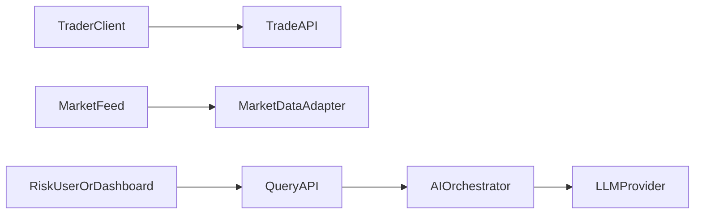
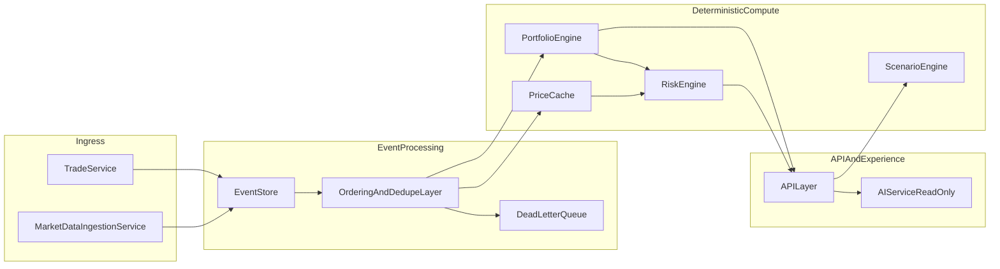
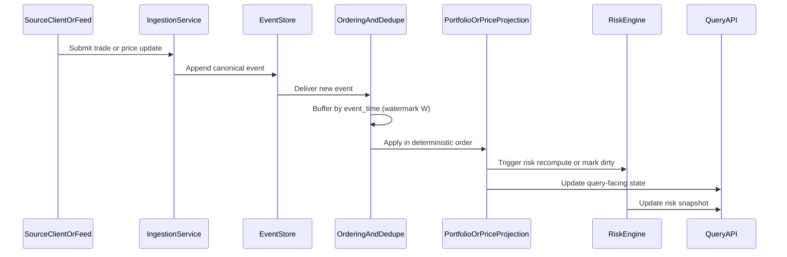

# High-Level System Design (HLD)
## Real-Time Portfolio & Risk Engine with AI Insights

## 1. Purpose

This document defines the high-level system design for the portfolio and risk platform described in `docs/design/PRD.md`.

It explains:
- Core components and their responsibilities.
- How data flows through the platform in real time.
- How correctness, replayability, and explainability are enforced.
- What is in scope for v1 versus future extensions.

This is intentionally implementation-agnostic so the design can be executed in any modern backend stack.

---

## 2. Scope and design constraints

The system must satisfy the following PRD constraints:
- Event-driven source of truth (append-only events).
- Deterministic portfolio and risk calculations.
- Out-of-order event handling with explicit policy.
- AI is read-only and grounded in real computed outputs.
- Traceability from derived metrics back to source inputs.

Locked v1 product decisions:
- Cost basis: weighted average cost.
- VaR: parametric normal VaR, 95% confidence, 1-day horizon.

**Reference implementation note:** The Go service in this repository implements append-only ingestion, dual apply workers (trades vs price shards), and partial projections (quantities + `prices_projection`; full average-cost/PnL and read APIs are still in progress). See `docs/design/LLD.md` §2.1 for detail.

---

## 3. System context

External interfaces:
- Trade clients submit buy/sell intent.
- Market data source publishes price updates.
- Portfolio/risk consumers query APIs.
- AI provider generates narrative insights from structured data.

---

## 4. Logical architecture

### Component responsibilities

- `TradeService`
  - Validates incoming trade requests.
  - Emits canonical trade events.
  - Enforces request-level idempotency keys.

- `MarketDataIngestionService`
  - Normalizes incoming market data into canonical price events.
  - Adds source metadata for auditability.

- `EventStore`
  - Append-only immutable event log.
  - Primary source of truth for replay/recovery.

- `OrderingAndDedupeLayer`
  - Applies event-time ordering with configurable watermark buffer `W`.
  - Deduplicates by `event_id` (or strict business key).
  - Routes unprocessable late/corrupt events to dead-letter.

- `PortfolioEngine`
  - Deterministic projection from ordered events.
  - Maintains positions, average cost, realized and unrealized PnL.
  - Maintains in-memory projection state per portfolio/account for low-latency reads.
  - Persists periodic snapshots for faster restart and reconciliation.

- `PriceCache`
  - Stores latest accepted mark price per symbol (`prices_projection` in the reference app).
  - Feeds valuation and risk once those layers read it; updates commit **independently** from position applies (asynchronous ingestion—see LLD §14.1).
  - Remains the single valuation source for mark-to-market in v1 when pricing exists for a symbol.

- `RiskEngine`
  - Computes exposure, concentration, volatility inputs, and parametric VaR.
  - Produces assumptions metadata with each result.

- `ScenarioEngine`
  - Reads the current portfolio projection and price cache snapshot.
  - Applies user-defined shocks to scenario-local inputs.
  - Computes deterministic projected outcomes.
  - Never mutates production projection state.

- `APILayer`
  - Serves current portfolio state, risk metrics, scenario outputs, and explainability payloads.
  - Acts as controlled interface for AI input assembly.

- `AIServiceReadOnly`
  - Receives structured JSON only.
  - Returns grounded narrative explanations with referenced symbols/metrics.
  - Never writes to event store or state projections.

---

## 5. Core data model (conceptual)

### 5.1 Event envelope

All domain events share a common envelope:
- `event_id` (globally unique)
- `event_type` (for example, `TradeExecuted`, `PriceUpdated`)
- `event_time` (source/business timestamp)
- `processing_time` (ingestion timestamp)
- `source` (origin system/feed)
- `payload` (type-specific data)
- `idempotency_key` (if separate from `event_id`)

### 5.2 Key event types

- `TradeExecuted`
  - `trade_id`, `symbol`, `side`, `quantity`, `price`, `event_time`
- `PriceUpdated`
  - `symbol`, `price`, `event_time`, `source`

### 5.3 Projections and query state

- `positions_projection`
  - symbol, quantity, average_cost, realized_pnl, unrealized_pnl, last_event_id
- `prices_projection`
  - symbol, last_price, as_of_event_time, as_of_event_id
- `risk_snapshot` (optional materialized)
  - exposure_by_symbol, concentration, volatility_input, var_95_1d, assumptions

---

## 6. Event lifecycle and real-time processing

Processing semantics:
- Event-time is authoritative for ordering.
- Processing-time is used for monitoring/latency metrics.
- Deterministic order key: `(event_time ASC, event_id ASC)`.

**Reference implementation:** Trade and price events are applied by **separate** in-process worker pools; each pool advances its own `projection_cursor` partitions. There is no single database transaction spanning both `positions_projection` and `prices_projection` for the same client request.

---

## 7. Accounting and valuation behavior

v1 accounting strategy is weighted average cost:
- Buy events update position quantity and average cost.
- Sell events realize PnL using average cost at execution time.
- Unrealized PnL is mark-to-market using latest accepted price.

Determinism guarantees:
- Same ordered event stream produces identical projection state.
- Replay is equivalent to live processing (within defined ordering policy).

### 7.1 Portfolio state model (v1)

- `PortfolioEngine` maintains an in-memory projection per portfolio/account.
- Snapshots are periodically persisted to reduce restart and replay time.
- Recovery path is load latest snapshot then replay subsequent events from `EventStore`.
- Full replay from event-log origin remains the source-of-truth recovery mechanism.

**Reference implementation today:** Workers hydrate quantities from `positions_projection` and replay trade events from `events` using persisted `projection_cursor` rows; `portfolio_snapshots` table exists but is not yet used for recovery. Price side replays from `events` per synthetic shard with its own cursor.

---

## 8. Ordering, late data, and reconciliation

### 8.1 Ordering policy

- Maintain watermark buffer `W` (configurable, expected 1-5 seconds).
- Apply events when safe relative to max observed event-time.
- Apply events single-threaded per partition to preserve deterministic order.

### 8.2 Late-event policy

- If event arrives within ordering tolerance, reorder and apply deterministically.
- If event arrives beyond tolerance:
  - Route to dead-letter with reason, and/or
  - Emit correction workflow (replay/recompute).

### 8.3 Reconciliation

- Periodic replay or checkpoint validation ensures projection integrity.
- Drift detection triggers rebuild from event store.

### 8.4 Concurrency model (v1)

- Event application is single-threaded within a partition key.
- Read requests are served from the latest committed projection snapshot.
- This avoids read/write and write/write races in projection state.

**Reference implementation:** Partitioning uses `portfolio_id` for trades (hashed across `APPLY_WORKER_COUNT` goroutines, one portfolio per worker at a time) and synthetic `portfolio_id` shards for prices (`PRICE_APPLY_WORKER_COUNT`). HTTP reads for full portfolio state are not exposed yet; when added, they should respect cross-projection semantics in LLD §14.1.

---

## 9. Risk computation design (v1)

Risk outputs:
- Exposure by symbol and total.
- Concentration metrics.
- Volatility estimate (documented window and scaling convention).
- Parametric VaR with fixed assumptions:
  - Confidence: 95%
  - Horizon: 1 day
  - Normal model and declared Z-score convention

Every risk response includes:
- Inputs used.
- Assumptions block.
- Timestamp/event boundary used for computation.

### 9.1 Risk recomputation trigger policy (v1)

Risk recomputation is triggered by:
- Any `TradeExecuted` event.
- Any `PriceUpdated` event for a symbol with open position quantity.

Optional optimization:
- Debounce recomputation in short windows (for example 100-500 ms) during bursts while preserving deterministic as-of labeling.

---

## 10. AI integration design (read-only interpreter)

AI receives structured payloads only:
- Portfolio snapshot
- Risk snapshot
- Event-driven deltas and drivers
- Scenario outputs

AI output requirements:
- Reference real symbols and numeric values from provided payload.
- Return an explicit insufficient-data response if required fields are missing.
- No write paths to event store, projections, or trading interfaces.

---

## 11. Explainability and lineage

Each derived output should be traceable to:
- Source event IDs and time range.
- Intermediate components used (projection stage, risk stage).
- Key contributing symbols and deltas.

Minimum v1 API support:
- `driving_event_ids`
- `contributing_symbols`
- `assumptions`
- `as_of_event_time`
- `as_of_event_id`

---

## 12.1 As-of semantics (API contract)

All portfolio, risk, and scenario responses should include:
- `as_of_event_id`
- `as_of_event_time`
- `as_of_processing_time` (recommended)

---

## 12. API surface (high-level)

Representative endpoint groups:
- Portfolio
  - current positions
  - portfolio valuation and PnL
- Risk
  - latest risk snapshot
  - explainability metadata
- Scenarios
  - run structured scenario
  - return projected PnL/risk outputs
- AI insights
  - explain current state
  - explain change over time

Exact OpenAPI and schemas are part of low-level design.

---

## 13. Reliability and operational considerations

Key failure modes:
- Duplicate events.
- Feed delays and out-of-order bursts.
- Missing price for held symbol.
- Upstream timestamp skew.

Controls:
- Idempotency checks at ingress and apply layers.
- Dead-letter queue with replay tooling.
- Health checks for ingestion lag and projection lag.
- Replay from event log for recovery and audit.
- Bounded ordering buffers with overflow handling (reject + dead-letter with reason).
- Ingestion-side rate limiting during bursts.

### Missing price behavior (v1)

- If a held symbol has no accepted price, mark it as `unpriced`.
- Exclude unpriced symbols from marked valuation and VaR inputs.
- Return `unpriced_symbols` warnings in API responses.

### System invariants

- Event processing is idempotent.
- Position quantity is non-negative in v1 (no shorting).
- Portfolio marked value equals the sum of priced position market values.
- Derived state from live processing matches replay output for the same ordered event set.

---

## 14. Security and access boundaries

- API authentication/authorization required for trade and query endpoints.
- Principle of least privilege between components.
- AI integration isolated behind API/DTO boundary (no direct data-store credentials).
- Audit logs for trade submissions and administrative replay actions.

---

## 15. Deployment topology (v1 recommendation)

Recommended v1 topology:
- Modular monolith or small set of services in one runtime boundary.
- Single event log and projection storage.
- Background worker for ordering/replay/reconciliation tasks.

Rationale:
- Minimizes operational complexity while preserving clear architectural boundaries.
- Supports future extraction into microservices if throughput/team scale demands it.

---

## 16. Scalability path (future)

When scale requires:
- Partition event processing by explicit partition key.
- Move from synchronous projection updates to asynchronous materialization pipelines.
- Introduce dedicated risk compute workers.
- Add historical VaR and pluggable accounting strategies (FIFO) behind stable interfaces.

### 16.1 Partitioning strategy

v1:
- Single partition is acceptable for demo and single-portfolio use.

Scale-out path:
- Preferred partition key is `portfolio_id` to preserve per-portfolio ordering.
- Alternative partitioning by `symbol` is possible for symbol-centric workloads.
- Ordering guarantees remain strict within each partition.

---

## 17. Traceability to PRD phases

- Phase 1: Event store + portfolio projection + replay baseline.
- Phase 2: Real-time ingestion and query freshness.
- Phase 3: Risk engine with parametric VaR assumptions.
- Phase 4: AI read-only interpretation layer.
- Phase 5: Scenario engine and advanced replay/reconciliation.

This HLD is intentionally aligned to `docs/design/PRD.md` and should remain stable as low-level design details are added.
