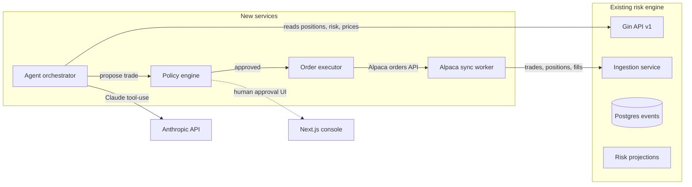

# Agentic trading roadmap

## Connector recommendation

Start with **Alpaca** as the single connector. Add **SnapTrade** later for read-only aggregation of other accounts you already hold.

Why Alpaca is the best starting point:
- **Free paper trading API** with the same endpoints as live — you can build and run the whole agent loop end-to-end without risking a dollar.
- **Commission-free live equities + options + crypto** in one API (so you get "both markets eventually" without a second integration).
- **Free real-time market data** (200 req/min) — replaces what you currently pull via Twelvedata for live quotes.
- **Best-in-class for algorithmic/agentic trading**; well documented, stable, used widely in algo systems.
- Key swap is the only thing that differs between paper and live.

Why not SnapTrade first:
- SnapTrade's strength is aggregating existing external accounts (Robinhood, Schwab, Coinbase, etc.) — read data and, for a subset of brokers, trade.
- Free tier (5 broker connections, real-time data, trading) is generous for personal use.
- But it adds a second party, and coverage/capabilities vary per broker. Using it as your execution venue from day one makes the agent loop harder to test and reason about.

Recommended split:
- **Alpaca** = agent's trading account (paper first, then small live budget).
- **SnapTrade** (phase 5+) = monitor your real brokerage/crypto accounts for a unified view and richer signal (holdings, cost basis, transactions) without making trades there.

## Architecture

Key integration points in the existing code:
- `internal/ingestion/service.go` already validates + appends `TradeExecuted` and `PriceUpdated` events with idempotency; the Alpaca worker just becomes a new producer of these events.
- `internal/api/handlers.go` (`postTradeHandler`) is the template for how an external fill turns into a domain event — we reuse the same envelope shape, with `source = "alpaca"` and `idempotency_key = alpaca_fill_id`.
- `internal/events/postgres.go` `Append` already de-dupes on `(portfolio_id, idempotency_key)`, so re-syncing the same Alpaca window is safe.
- `internal/pricesource/twelvedata.go` is the pattern for a new `alpacaprovider` adapter.

## Phased roadmap

### Phase 0 — Alpaca connector (foundation)
- New Go package `internal/connectors/alpaca` with a thin client (accounts, positions, activities, orders, market data stream).
- Sync worker that periodically pulls broker activities and emits `TradeExecuted` events through `ingestion.Service` using `alpaca_fill_id` as the idempotency key.
- One-time backfill command to import account history.
- Config via `.env`: `ALPACA_KEY_ID`, `ALPACA_SECRET_KEY`, `ALPACA_BASE_URL` (paper vs live).
- UI: "Connect Alpaca" page; show last sync time, drift between Alpaca positions and internal projection.
- Optional: replace or supplement Twelvedata with Alpaca real-time data for tickers you hold.

Deliverable: you never type a trade again for the Alpaca account; positions reconcile automatically.

### Phase 1 — Read-only agent (human-in-the-loop recommendations)
- New `internal/agent` service (Go) plus a thin Next.js "Briefing" page.
- Agent exposes tools to Claude via the Anthropic API with `tool_use`:
  - `get_portfolio_state`, `get_risk_snapshot`, `get_price_history`, `get_market_news`, `get_positions`, `get_buying_power`.
- **No execution tools in this phase.** Output is a structured "briefing" + ranked trade ideas with rationale, confidence, size suggestion, stop/target.
- Schedule: on-demand button + daily cron ("morning briefing").
- Prompting: single agent (cheaper, faster to iterate) with an explicit system prompt that enforces "propose, never execute."
- Observability: persist every tool call, prompt, and response to a new table `agent_sessions` for audit/replay.

Deliverable: you get Claude-authored daily recommendations that you manually execute in Alpaca paper.

### Phase 2 — Policy engine and proposal pipeline
- New `internal/policy` package implementing **policy-as-code** (deterministic, outside the LLM):
  - Per-symbol whitelist/blacklist.
  - Max order notional, max position %, max daily loss, market-hours rule, pattern-day-trader guard.
  - Kill switch table + env flag.
- `ProposedTrade` becomes a first-class entity (new Postgres table) with lifecycle `proposed → approved → submitted → filled | rejected | cancelled`.
- Approval UI: list of proposals, one-click approve/deny, reasoning preview, policy-check result.
- Still human-in-the-loop, but the mechanical parts are codified.

Deliverable: the agent can suggest trades, the policy engine vets them, you click to execute — all inside the console.

### Phase 3 — Bounded autonomous execution (paper)
- Add execution tool: `submit_order(symbol, qty, side, type, tif, client_order_id)` — gated by the policy engine, never called directly by the LLM.
- Flip `AGENT_EXEC_MODE=paper_auto`: proposals that pass policy auto-submit to Alpaca **paper**; violations alert and stay `proposed`.
- Introduce a "Self-critic" pass (a second Claude call or an explicit reasoning step) that must approve before auto-submit. (Research supports this adversarial-check pattern.)
- Add evaluations: replay recent sessions against a deterministic mock Alpaca to measure PnL, Sharpe, max drawdown, rule violations.

Deliverable: a fully automated paper-trading agent with measurable performance.

### Phase 4 — Small live budget with hard caps
- Require Phase 3 eval to beat a simple baseline over N weeks of paper.
- Switch to live Alpaca with a small budget (e.g. $200–$500) and strict caps:
  - Per-trade max, per-day max, per-week drawdown stop → kill switch.
  - Email/push on every live fill.
- Keep a "shadow paper" run alongside the live account for ongoing A/B.

Deliverable: bounded autonomy with real money; you scale the budget as confidence grows.

### Phase 5 — SnapTrade aggregation (unified portfolio view)
- Add `internal/connectors/snaptrade` with read-only sync for your other accounts.
- Model those accounts as separate portfolios owned by your user; unify risk views across them.
- Agent can now reason over your whole book (not just Alpaca) even though it only trades in Alpaca.
- Optional: enable SnapTrade trading in a later slice if/when Alpaca is insufficient.

### Phase 6 — Multi-agent + richer signal (optional scale-up)
- Split into specialist agents (e.g. Market Analyst, Risk Officer, Execution Trader, Self-critic) coordinated by a small orchestrator.
- Add alt-data tools (news sentiment, filings, calendar, crypto on-chain).
- Consider Anthropic's **Managed Agents** for long-running autonomous sessions with sandboxed containers, if costs justify it.

## Claude agent approach (concrete)

- **Hosting**: start with the standard **Anthropic Messages API + tool use** from your Go agent service. This keeps state in your Postgres and tools in your code. Simpler to test, cheaper to iterate, and you keep full auditability. Revisit Managed Agents only when session length / cost drives it.
- **Pattern**: single-agent with strongly-typed tools until metrics say you need specialists. Research consensus is that multi-agent is valuable only when tasks meaningfully diverge.
- **Guardrails** (research-backed best practices we will implement):
  - Policy-as-code outside the LLM (Phase 2).
  - Tool contracts with JSON-schema validation and idempotency keys.
  - Self-critic / veto step before any side-effectful tool (Phase 3).
  - Per-tool permission levels (`always_allow` for reads, `always_ask` for live orders until Phase 4).
  - Full trace/audit of every step; replayable sessions.
  - Deterministic pre-trade checks: buying power, position limits, market hours.

## What I need from you before Phase 0

- Sign up for **Alpaca paper** and drop the key pair in `.env` (`ALPACA_KEY_ID`, `ALPACA_SECRET_KEY`, `ALPACA_BASE_URL=https://paper-api.alpaca.markets`).
- Confirm your **budget cap** for the eventual live phase (used as a hard policy constant from day one even in paper, so the agent "thinks" within real limits).
- Confirm Anthropic API access for the agent service (`ANTHROPIC_API_KEY`).

## Risks and tradeoffs to know up front

- **LLM hallucination on numbers** — mitigated by policy-as-code and deterministic pre-trade checks; the LLM never does math that matters.
- **Overfitting paper → live** — paper fills are optimistic; expect worse slippage live. The Phase 4 shadow-paper A/B is how we catch this.
- **Regulatory**: live trading is real brokerage activity. Alpaca handles KYC and the broker-dealer side, but you are still the account owner; taxes and reporting apply.
- **Data coverage**: Alpaca's US-equity data is excellent; for richer fundamentals/news you will likely want an additional read-only data vendor (Twelvedata stays useful, or we add news later in Phase 6).
- **SnapTrade coverage gaps**: not every broker supports the same features; we'll use it for read-only first, which is the broadest surface.