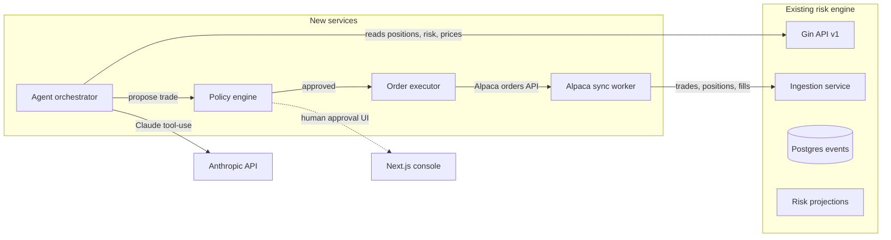

# Agentic trading roadmap

## Current direction

Phases **0–3 are largely implemented** in this repo (Alpaca connector, agent briefings, policy/proposals, paper auto-execution with safety workers). **Active focus is Phase 4**: run the stack 24/7 off your laptop, paper-trade autonomously in the background, and **stabilize + verify** before any live-money work (Phase 5+) or large new features.

## Connector recommendation

Start with **Alpaca** as the single connector. Add **SnapTrade** later for read-only aggregation of other accounts you already hold.

Why Alpaca is the best starting point:
- **Free paper trading API** with the same endpoints as live — you can build and run the whole agent loop end-to-end without risking a dollar.
- **Commission-free live equities + options + crypto** in one API (so you get "both markets eventually" without a second integration).
- **Free real-time market data** (200 req/min) — replaces what you currently pull via Twelvedata for live quotes.
- **Best-in-class for algorithmic/agentic trading**; well documented, stable, used widely in algo systems.
- Key swap is the only thing that differs between paper and live.

Why not SnapTrade first:
- SnapTrade's strength is aggregating existing external accounts (Robinhood, Schwab, Coinbase, etc.) — read data and, for a subset of brokers, trade.
- Free tier (5 broker connections, real-time data, trading) is generous for personal use.
- But it adds a second party, and coverage/capabilities vary per broker. Using it as your execution venue from day one makes the agent loop harder to test and reason about.

Recommended split:
- **Alpaca** = agent's trading account (paper first, then small live budget).
- **SnapTrade** (phase 6+) = monitor your real brokerage/crypto accounts for a unified view and richer signal (holdings, cost basis, transactions) without making trades there.

## Architecture

Key integration points in the existing code:
- `internal/ingestion/service.go` already validates + appends `TradeExecuted` and `PriceUpdated` events with idempotency; the Alpaca worker just becomes a new producer of these events.
- `internal/api/handlers.go` (`postTradeHandler`) is the template for how an external fill turns into a domain event — we reuse the same envelope shape, with `source = "alpaca"` and `idempotency_key = alpaca_fill_id`.
- `internal/events/postgres.go` `Append` already de-dupes on `(portfolio_id, idempotency_key)`, so re-syncing the same Alpaca window is safe.
- `internal/pricesource/twelvedata.go` is the pattern for a new `alpacaprovider` adapter.

## Phased roadmap

### Phase 0 — Alpaca connector (foundation) ✓
- New Go package `internal/connectors/alpaca` with a thin client (accounts, positions, activities, orders, market data stream).
- Sync worker that periodically pulls broker activities and emits `TradeExecuted` events through `ingestion.Service` using `alpaca_fill_id` as the idempotency key.
- One-time backfill command to import account history.
- Config via `.env`: `ALPACA_KEY_ID`, `ALPACA_SECRET_KEY`, `ALPACA_BASE_URL` (paper vs live).
- UI: "Connect Alpaca" page; show last sync time, drift between Alpaca positions and internal projection.
- Optional: replace or supplement Twelvedata with Alpaca real-time data for tickers you hold.

Deliverable: you never type a trade again for the Alpaca account; positions reconcile automatically.

### Phase 1 — Read-only agent (human-in-the-loop recommendations) ✓
- New `internal/agent` service (Go) plus a thin Next.js "Briefing" page.
- Agent exposes tools to Claude via the Anthropic API with `tool_use`:
  - `get_portfolio_state`, `get_risk_snapshot`, `get_price_history`, `get_market_news`, `get_positions`, `get_buying_power`.
- **No execution tools in this phase.** Output is a structured "briefing" + ranked trade ideas with rationale, confidence, size suggestion, stop/target.
- Schedule: on-demand button + daily cron ("morning briefing").
- Prompting: single agent (cheaper, faster to iterate) with an explicit system prompt that enforces "propose, never execute."
- Observability: persist every tool call, prompt, and response to a new table `agent_sessions` for audit/replay.

Deliverable: you get Claude-authored daily recommendations that you manually execute in Alpaca paper.

### Phase 2 — Policy engine and proposal pipeline ✓
- New `internal/policy` package implementing **policy-as-code** (deterministic, outside the LLM):
  - Per-symbol whitelist/blacklist.
  - Max order notional, max position %, max daily loss, market-hours rule, pattern-day-trader guard.
  - Kill switch table + env flag.
- `ProposedTrade` becomes a first-class entity (new Postgres table) with lifecycle `proposed → approved → submitted → filled | rejected | cancelled`.
- Approval UI: list of proposals, one-click approve/deny, reasoning preview, policy-check result.
- Still human-in-the-loop, but the mechanical parts are codified.

Deliverable: the agent can suggest trades, the policy engine vets them, you click to execute — all inside the console.

### Phase 3 — Bounded autonomous execution (paper) ✓
- Add execution path: proposals that pass policy + self-critic auto-submit to Alpaca **paper** via `internal/proposals/submit` (not a direct LLM broker tool).
- Flip `AGENT_EXEC_MODE=paper_auto`: violations stay `proposed`; market-hours denials can retry when session opens.
- Self-critic pass before auto-submit; bracket orders from rationale; order reconciliation worker; tool-cache TTL.
- Offline eval harness: `go test ./internal/evaluation/...`

Deliverable: a fully automated paper-trading agent with measurable performance.

Rollout details: see [agent_paper_auto_rollout.md](agent_paper_auto_rollout.md).

---

### Phase 4 — Always-on deploy, evaluate, and stabilize ← **you are here**

**Goal:** Stop depending on your laptop. Run the **current** stack continuously in paper-auto mode, observe real scheduled behavior, fix bugs, polish UI, and **confirm every existing feature works** before adding live money or big new capabilities.

#### 4.1 — Deploy always-on infrastructure
- Host the same `docker compose` stack (Postgres + migrate + `app` + `web`) on a **VPS, home server, or cloud VM** that stays powered and networked.
- Store secrets in the host environment or a secrets manager — **not** in git (`ALPACA_*`, `ANTHROPIC_API_KEY`, DB URL, auth cookie secret).
- Expose the web UI over HTTPS (reverse proxy + TLS) or VPN-only access; lock down Postgres to the private network.
- Ensure containers **restart on failure** (`restart: unless-stopped` or orchestrator equivalent).
- Optional but recommended: uptime check on `/health` or feed status; log shipping or periodic `docker compose logs` review.

Deliverable: briefings, price feed, Alpaca sync, paper auto-submit, and reconciliation run **without your laptop**.

#### 4.2 — Evaluation period (paper, production-like)
- Run **at least N weeks** (suggest 4–8) with scheduled briefings + `AGENT_EXEC_MODE=paper_auto` on Alpaca paper only.
- Track observability already in the system:
  - Briefing success/failure rate, tool-call volume, rate limits.
  - Proposals created → policy deny vs allow → critic deny vs allow → submitted → filled/cancelled.
  - Feed staleness, watchlist hydrator behavior, position drift vs Alpaca.
- Use offline eval (`internal/evaluation`) for regression; use **live paper logs** for operational truth.
- Document incidents (missed cron, stale prices, policy surprises) and fix in place.

Deliverable: confidence that the agent loop is **reliable unattended**, not just correct in dev.

#### 4.3 — Stabilization and functionality confirmation (no new features)
During the evaluation window, prioritize **quality over scope**:
- **Bug fixes** — scheduler/idempotency, policy edge cases, broker recon, caching, settings hot-reload.
- **UI/UX** — settings, price data, proposals, briefing status; remove friction and stale-data confusion.
- **Functionality checklist** — explicitly verify end-to-end:
  - [ ] Alpaca link + sync + position reconciliation
  - [ ] Price feed + watchlist (manual + hydrator) + projected marks in UI
  - [ ] Manual + scheduled briefings; session audit trail
  - [ ] Proposal lifecycle: propose → policy → approve/deny → submit → fill/cancel
  - [ ] Paper auto: critic → auto-approve → submit → bracket/retry/recon
  - [ ] Policy limits, kill switch, market hours
  - [ ] Settings persist + hot-reload where supported

**Gate to Phase 5+:** evaluation period complete, checklist signed off, no P0/P1 open bugs, and paper performance / rule violations within agreed bounds.

---

### Phase 5 — Small live budget with hard caps
- **Requires Phase 4 exit criteria** (not merely “Phase 3 code merged”).
- Switch to live Alpaca with a small budget (e.g. $200–$500) and strict caps:
  - Per-trade max, per-day max, per-week drawdown stop → kill switch.
  - Email/push on every live fill.
- Keep a "shadow paper" run alongside the live account for ongoing A/B.

Deliverable: bounded autonomy with real money; scale the budget only after live shadow metrics look acceptable.

### Phase 6 — SnapTrade aggregation (unified portfolio view)
- Add `internal/connectors/snaptrade` with read-only sync for your other accounts.
- Model those accounts as separate portfolios owned by your user; unify risk views across them.
- Agent can now reason over your whole book (not just Alpaca) even though it only trades in Alpaca.
- Optional: enable SnapTrade trading in a later slice if/when Alpaca is insufficient.

### Phase 7 — Multi-agent + richer signal (optional scale-up)
- Split into specialist agents (e.g. Market Analyst, Risk Officer, Execution Trader, Self-critic) coordinated by a small orchestrator.
- Add alt-data tools (news sentiment, filings, calendar, crypto on-chain).
- Consider Anthropic's **Managed Agents** for long-running autonomous sessions with sandboxed containers, if costs justify it.

## Claude agent approach (concrete)

- **Hosting**: Anthropic Messages API + tool use from the Go agent service; state in Postgres; full audit trail. Phase 4 moves this to **always-on** hosting; Managed Agents remain optional (Phase 7).
- **Pattern**: single-agent with strongly-typed tools until metrics say you need specialists.
- **Guardrails**:
  - Policy-as-code outside the LLM (Phase 2).
  - Tool contracts with JSON-schema validation and idempotency keys.
  - Self-critic / veto step before any side-effectful submit (Phase 3).
  - Per-tool permission levels (`always_allow` for reads, `always_ask` for live orders until Phase 5).
  - Full trace/audit of every step; replayable sessions.
  - Deterministic pre-trade checks: buying power, position limits, market hours.

## What I need from you before Phase 0

- Sign up for **Alpaca paper** and drop the key pair in `.env` (`ALPACA_KEY_ID`, `ALPACA_SECRET_KEY`, `ALPACA_BASE_URL=https://paper-api.alpaca.markets`).
- Confirm your **budget cap** for the eventual live phase (used as a hard policy constant from day one even in paper).
- Confirm Anthropic API access for the agent service (`ANTHROPIC_API_KEY`).

For **Phase 4**, additionally: pick a host (VPS/cloud), domain or VPN access, and an evaluation window length + success criteria (e.g. max briefing failure rate, max policy violation rate per week).

## Risks and tradeoffs to know up front

- **LLM hallucination on numbers** — mitigated by policy-as-code and deterministic pre-trade checks; the LLM never does math that matters.
- **Laptop-only operation** — until Phase 4 deploy completes, missed cron ticks and stale data are expected when the machine sleeps; Phase 4 exists to remove that dependency.
- **Overfitting paper → live** — paper fills are optimistic; expect worse slippage live. The Phase 5 shadow-paper A/B is how we catch this.
- **Regulatory**: live trading is real brokerage activity. Alpaca handles KYC and the broker-dealer side, but you are still the account owner; taxes and reporting apply.
- **Data coverage**: Alpaca's US-equity data is excellent; for richer fundamentals/news you will likely want an additional read-only data vendor (Twelvedata stays useful, or we add news later in Phase 7).
- **SnapTrade coverage gaps**: not every broker supports the same features; we'll use it for read-only first, which is the broadest surface.
