# Automated Price Feed Plan

## Provider Strategy (free-first, upgrade-ready)
- **Primary candidate (v1 free): Twelve Data** for multi-asset coverage (equities/FX/crypto) with a practical request budget and simple REST/WebSocket options.
- **Future fallback candidates:** Finnhub and Alpha Vantage can be added later when multi-provider failover is needed.
- **Out of scope for free v1:** Polygon/Massive real-time usage (free tier too limited for sustained flow).

## Why this fits current architecture
- Existing canonical ingestion seam already exists at `POST /v1/prices` in [internal/api/handlers.go](/Users/kevinreardon/Projects/RealTimePortfolioRiskEngine/internal/api/handlers.go).
- Existing workers already consume `PriceUpdated` events and maintain `prices_projection`, `symbol_returns`, and risk recompute in [internal/events/price_worker_pool.go](/Users/kevinreardon/Projects/RealTimePortfolioRiskEngine/internal/events/price_worker_pool.go) and [internal/events/postgres.go](/Users/kevinreardon/Projects/RealTimePortfolioRiskEngine/internal/events/postgres.go).
- Therefore, safest implementation is an **external feed adapter** that publishes into the same event stream contract (no projection/risk rewrites).

## Target design

```mermaid
flowchart LR
  providerApi[Provider APIs] --> feedAdapter[PriceFeed Adapter]
  feedAdapter --> normalizer[Symbol/Quote Normalizer]
  normalizer --> deduper[Freshness + Dedup + Throttle]
  deduper --> ingest[Ingestion Service or POST /v1/prices]
  ingest --> events[(events table)]
  events --> priceWorkers[Price Worker Pool]
  priceWorkers --> projections[(prices_projection + symbol_returns)]
  projections --> riskRecompute[Risk Recompute Trigger]
  riskRecompute --> apiRead[Portfolio/Risk API]
```

## Implementation slices
- **Slice 1: Feed configuration + watchlists**
  - Add provider/env config in [internal/config/config.go](/Users/kevinreardon/Projects/RealTimePortfolioRiskEngine/internal/config/config.go): provider choice, API keys, poll interval, symbols, per-provider rate caps, timeout/retry.
  - Add clear env examples in [.env.example](/Users/kevinreardon/Projects/RealTimePortfolioRiskEngine/.env.example) and [web/.env.example](/Users/kevinreardon/Projects/RealTimePortfolioRiskEngine/web/.env.example) docs references.

- **Slice 2: Provider abstraction**
  - Introduce `PriceProvider` interface (quote batch fetch + health metadata).
  - Implement `TwelveDataProvider` (primary) adapter in a new `internal/pricesource/` package.
  - Normalize provider symbols to internal symbols used by `PricePayload`.

- **Slice 3: Ingestion runner**
  - Add a long-running `PriceIngestor` loop in a new `internal/ingestion/pricefeed/` package:
    - interval scheduler (~30s/60s)
    - provider failover policy
    - idempotency key strategy (`provider:symbol:timestamp_bucket`)
    - source sequence monotonicity per symbol
    - backoff/jitter on 429 and network failures.
  - Emit through existing `ingestion.Service.Ingest(...)` directly (preferred internal path) or internal HTTP client to `POST /v1/prices` for strict boundary parity.

- **Slice 4: Startup wiring + observability**
  - Wire the ingestor in [cmd/server/main.go](/Users/kevinreardon/Projects/RealTimePortfolioRiskEngine/cmd/server/main.go) with graceful shutdown.
  - Add logs + metrics for: fetch latency, symbols fetched, symbols ingested, dropped stale quotes, provider failover events, and rate-limit hits.

- **Slice 5: Data safety + quality guards**
  - Add freshness checks (reject stale quotes older than configured max age).
  - Add per-symbol dedup (skip unchanged price within short windows to reduce write churn).
  - Keep existing worker ordering/watermark protections unchanged.

- **Slice 6: Price Data UI (replace manual page)**
  - Replace route/page at [web/src/app/(dashboard)/ingest/price/page.tsx](/Users/kevinreardon/Projects/RealTimePortfolioRiskEngine/web/src/app/(dashboard)/ingest/price/page.tsx) with a **Price Data** page focused on read/query workflows.
  - Build symbol lookup panel:
    - search by ticker/symbol
    - show latest price, last update time, provider/source, and short mini-history summary.
  - Build large list/table panel:
    - sortable/filterable list for all tracked symbols
    - columns for symbol, last price, change %, as-of time, provider health/status
    - pagination/virtualization for scale.
  - Add “Feed status” header card (active provider, fallback state, last successful fetch, error banner).
  - Keep manual price ingestion UI out of primary navigation; retain it as admin/debug fallback only.

## Testing strategy
- **Unit tests**
  - Provider adapters: auth, parsing, symbol mapping, error mapping.
  - Ingestor loop: throttling, failover, idempotency key generation, stale quote filtering.
- **Integration tests**
  - Simulate provider responses and assert `events -> prices_projection -> symbol_returns` pipeline updates.
  - Verify risk endpoint recovers from `INSUFFICIENT_DATA` as multiple dates accumulate.
- **Operational test**
  - Docker profile enabling feed runner with sandbox symbols (AAPL, MSFT, BTC/USD, EUR/USD) and 1-minute cadence.

## Rollout
- Phase 1: behind `PRICE_FEED_ENABLED=false` default.
- Phase 2: enable in dev/staging with free provider quotas and dashboards.
- Phase 3: optional paid upgrade path by changing provider/env only (no architecture change).

## Success criteria
- New prices flow continuously without manual UI entry.
- Users can inspect prices through a dedicated Price Data page (lookup + large list) without using manual record forms.
- `symbol_returns` accumulates enough history to eliminate frequent `INSUFFICIENT_DATA` for active symbols.
- End-to-end pipeline remains stable under free-tier rate limits via throttling + fallback.